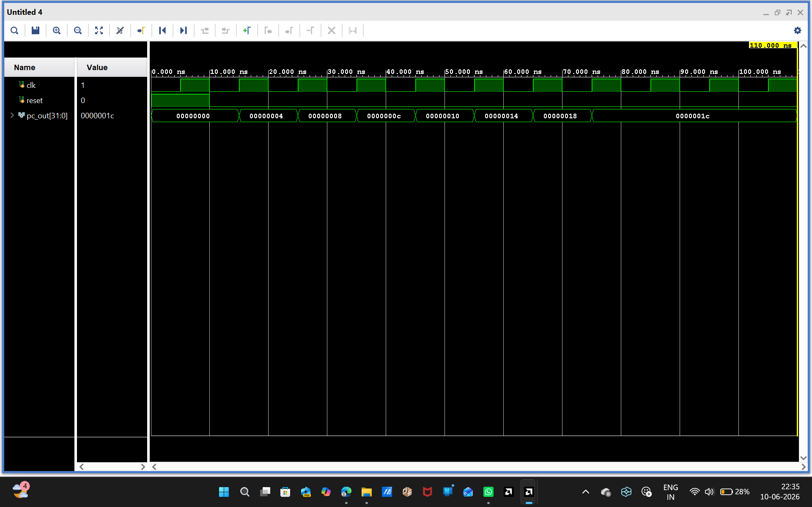
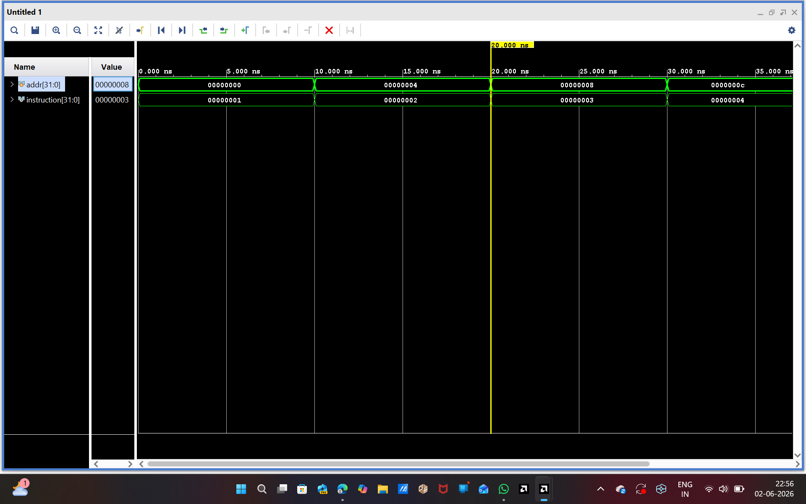
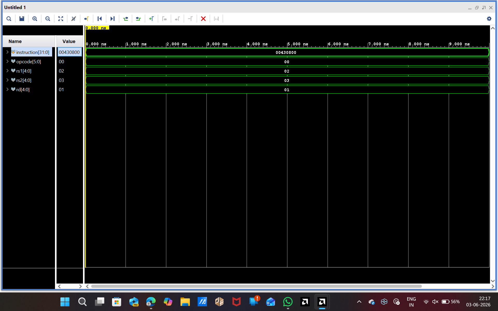
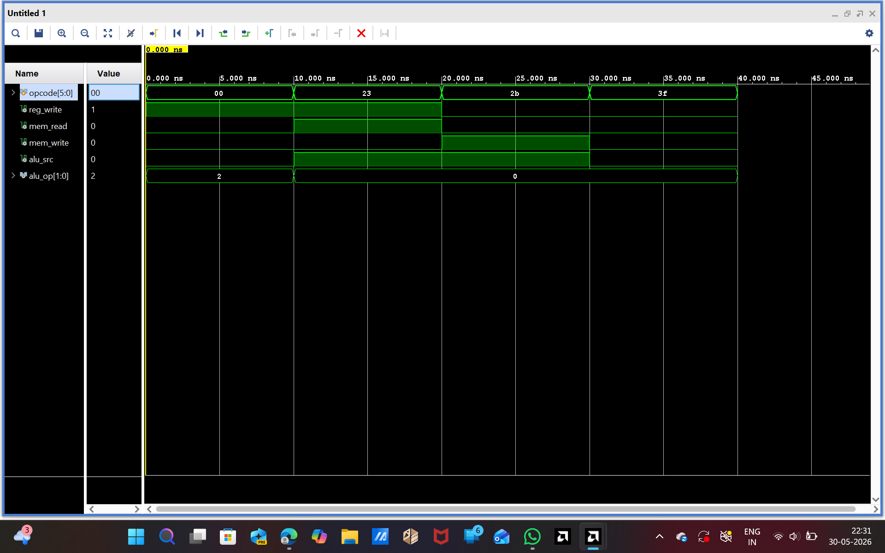
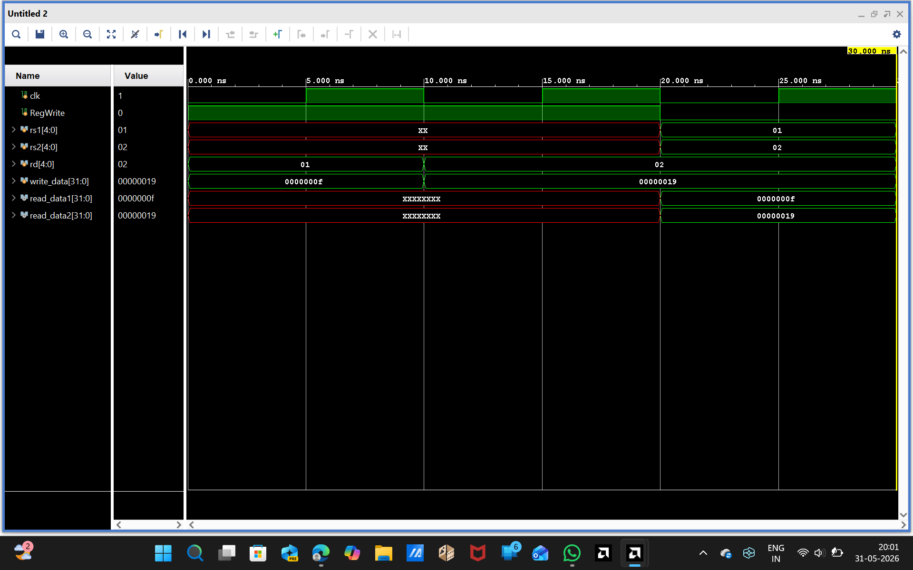
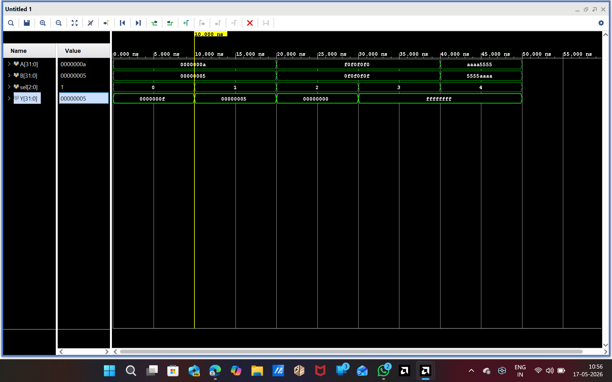
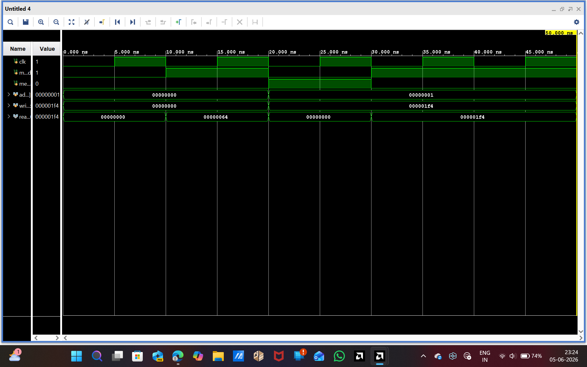
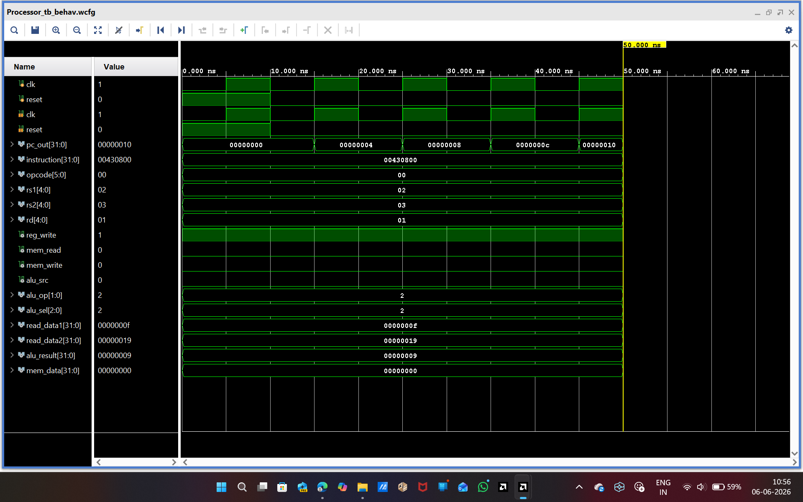
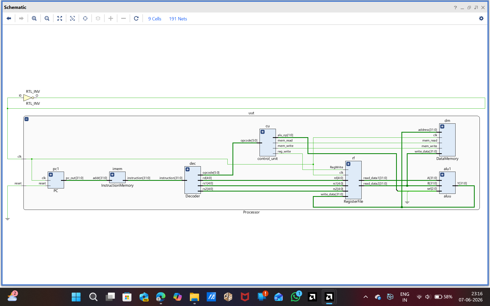

## 32-Bit Single-Cycle Processor in Verilog

## Overview

This project implements a 32-bit Single-Cycle Processor using Verilog HDL. The processor executes instructions in a single clock cycle and integrates key datapath components such as the Program Counter, Instruction Memory, Decoder, Control Unit, Register File, ALU, and Data Memory.

The design was developed and simulated using Xilinx Vivado.

---

## Features

- 32-bit Processor Architecture
- Single-Cycle Execution
- Modular Verilog Design
- Instruction Fetch and Decode
- Register File Operations
- Arithmetic and Logical Operations
- Data Memory Read/Write Operations
- Complete Processor-Level Integration

---

## Processor Modules

| Module | Description |
|----------|-------------|
| Program Counter (PC) | Generates instruction addresses |
| Instruction Memory | Stores processor instructions |
| Instruction Decoder | Extracts opcode and register fields |
| Control Unit | Generates control signals |
| Register File | Stores and retrieves register values |
| ALU | Performs arithmetic and logic operations |
| Data Memory | Handles load/store operations |
| Processor Top Module | Integrates all processor components |

---

# Simulation Results

## 1. Program Counter (PC)

The Program Counter increments by 4 on every clock cycle, demonstrating sequential instruction execution.



**Observation:**
- PC values progress as:
  - 0x00000000
  - 0x00000004
  - 0x00000008
  - 0x0000000C
  - ...
- Confirms correct instruction address generation.

---

## 2. Instruction Memory

The Instruction Memory outputs instructions corresponding to the supplied addresses.



**Observation:**
- Address 0 → Instruction 1
- Address 4 → Instruction 2
- Address 8 → Instruction 3
- Address 12 → Instruction 4

This verifies proper instruction fetching.

---

## 3. Instruction Decoder

The decoder successfully extracts instruction fields from the fetched instruction.



**Observation:**
- Instruction = 0x00430800
- Opcode = 0x00
- rs1 = 2
- rs2 = 3
- rd = 1

This confirms correct decoding of instruction fields.

---

## 4. Control Unit

The Control Unit generates control signals according to the opcode.



**Observation:**
- R-Type instruction enables register write.
- LOAD instruction enables memory read.
- STORE instruction enables memory write.
- ALU control signals change according to instruction type.

This verifies correct control signal generation.

---

## 5. Register File

The Register File performs register read and write operations correctly.



**Observation:**
- Data value 0x00000019 is written into a register.
- Read ports successfully retrieve stored values.
- Register access works as expected.

---

## 6. Arithmetic Logic Unit (ALU)

The ALU performs multiple arithmetic and logical operations.



**Observation:**

| ALU Select | Operation |
|------------|------------|
| 0 | Addition |
| 1 | Subtraction |
| 2 | AND |
| 3 | OR |
| 4 | XOR |

Waveform outputs confirm correct ALU functionality.

---

## 7. Data Memory

The Data Memory correctly performs read and write operations.



**Observation:**
- Data is written when MemWrite is enabled.
- Stored values are retrieved when MemRead is enabled.
- Memory address and data outputs behave correctly.

---

## 8. Processor-Level Simulation

The integrated processor successfully connects all modules and executes instructions.



**Observation:**
- Program Counter updates correctly.
- Instructions are fetched and decoded.
- Control signals are generated.
- Register values are read.
- ALU computes results.
- Data Memory operations function properly.

This confirms successful processor-level integration.

---
### RTL Architecture Diagram



## Tools Used

- Verilog HDL
- Xilinx Vivado Design Suite
- Vivado Simulator

---

## Project Structure

```
32-bit-single-cycle-processor-verilog/
│
├── PC.v
├── Instruction_Memory.v
├── Decoder.v
├── control_unit.v
├── register_file.v
├── aluu.v
├── data_memory.v
├── Processor.v
│
├── PC_tb.v
├── Instruction_Memory_tb.v
├── Decoder_tb.v
├── control_unit_tb.v
├── register_file_tb.v
├── aluu_tb.v
├── data_memory_tb.v
├── Processor_tb.v
│
├── waveforms/
│   ├── PC_waveform.png
│   ├── instruction_Memory_waveform.png
│   ├── Instruction_Decoder_waveform.png
│   ├── control_unit_waveform.png
│   ├── Register_File_waveform.png
│   ├── ALU_waveform.png
│   ├── Data_Memory_waveform.png
│   └── processor_simulation.png
│
└── README.md
```

---

## Author

**Bellam Udaya Sree**  
B.Tech in Electronics & Communication Engineering  
JNTUA College of Engineering, Ananthapuramu, Andhra Pradesh

---

## Future Improvements

- Pipeline Processor Design
- Hazard Detection Unit
- Forwarding Unit
- Branch and Jump Instructions
- Cache Memory Integration
- FPGA Implementation
