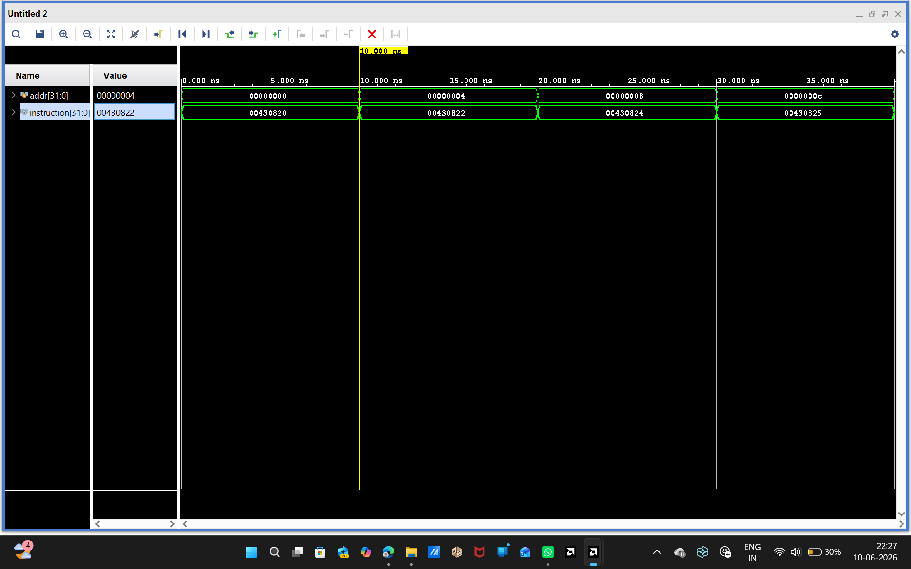
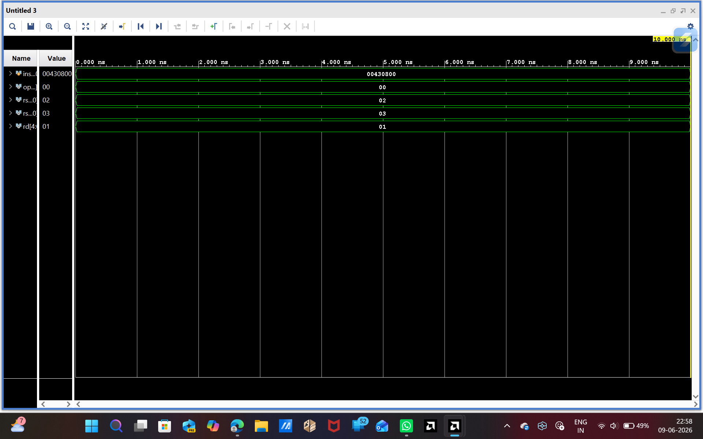
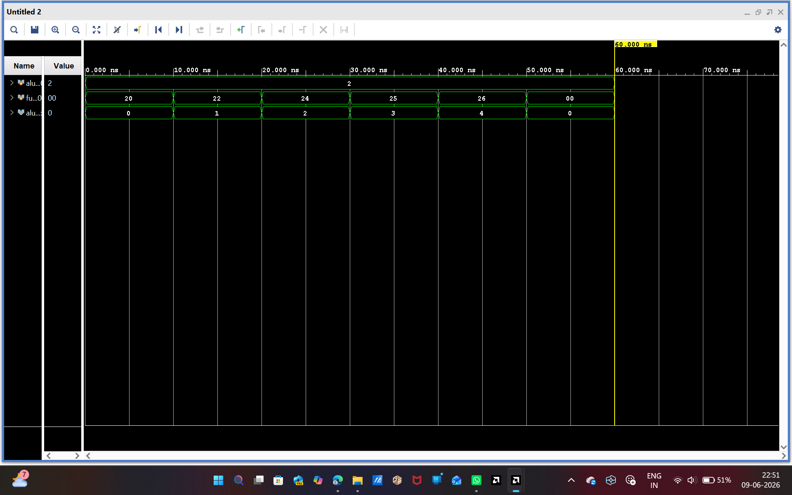
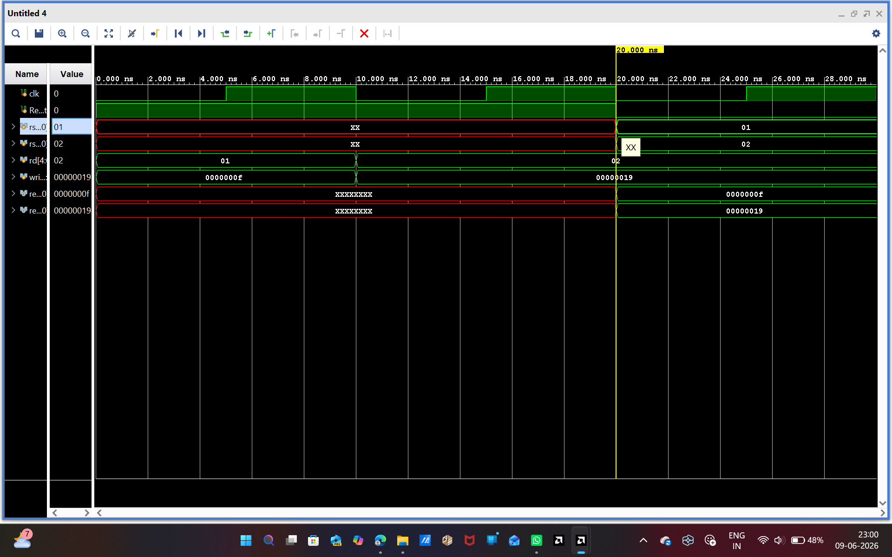
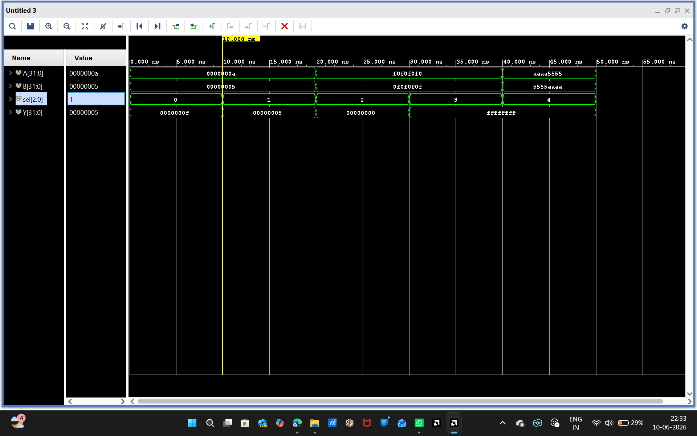
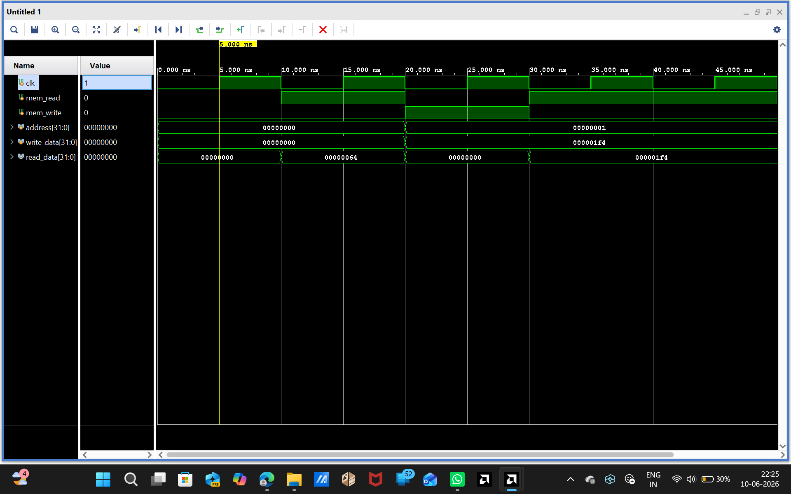

# 32-Bit Single-Cycle Processor in Verilog

## Overview

This project implements a 32-bit Single-Cycle Processor using Verilog HDL. The processor executes instructions in a single clock cycle and integrates key datapath components such as the Program Counter, Instruction Memory, Decoder, Control Unit, ALU Control Unit, Register File, ALU, and Data Memory.

The processor follows a modular architecture where each hardware block is designed, simulated, and verified independently before complete processor integration.

The design was developed and simulated using Xilinx Vivado.

---

## Features

* 32-bit Processor Architecture
* Single-Cycle Execution
* Modular Verilog Design
* Instruction Fetch and Decode
* Control Signal Generation
* ALU Control Logic
* Register File Operations
* Arithmetic and Logical Operations
* Data Memory Read/Write Operations
* Complete Processor-Level Integration
* RTL Schematic Verification
* Functional Simulation using Vivado

---

## Processor Modules

| Module               | Description                                    |
| -------------------- | ---------------------------------------------- |
| Program Counter (PC) | Generates instruction addresses                |
| Instruction Memory   | Stores processor instructions                  |
| Instruction Decoder  | Extracts opcode and register fields            |
| Control Unit         | Generates processor control signals            |
| ALU Control Unit     | Converts ALUOp signals into ALU select signals |
| Register File        | Stores and retrieves register values           |
| ALU                  | Performs arithmetic and logic operations       |
| Data Memory          | Handles load/store operations                  |
| Processor Top Module | Integrates all processor components            |

---

# Simulation Results

## 1. Program Counter (PC)

The Program Counter increments by 4 on every clock cycle, demonstrating sequential instruction execution.


### Observation

* PC values progress as:

  * 0x00000000
  * 0x00000004
  * 0x00000008
  * 0x0000000C
  * 0x00000010
  * 0x00000014
  * 0x00000018

This confirms correct instruction address generation.

---

## 2. Instruction Memory

The Instruction Memory outputs instructions corresponding to supplied addresses.



### Observation

* Address 0 → Instruction 0x00430820
* Address 4 → Instruction 0x00430822
* Address 8 → Instruction 0x00430824
* Address 12 → Instruction 0x00430825

This verifies correct instruction fetching functionality.

---

## 3. Instruction Decoder

The decoder extracts instruction fields from fetched instructions.



### Observation

For instruction:

0x00430800

Decoded fields:

* Opcode = 0x00
* rs1 = 2
* rs2 = 3
* rd = 1

This confirms proper instruction decoding.

---

## 4. Control Unit

The Control Unit generates control signals according to instruction opcode.


### Observation

* R-Type instruction enables register write.
* LOAD instruction enables memory read.
* STORE instruction enables memory write.
* ALUOp changes according to instruction category.

Generated signals include:

* RegWrite
* MemRead
* MemWrite
* ALUSrc
* ALUOp

This verifies correct control signal generation.

---

## 5. ALU Control Unit

The ALU Control Unit converts ALUOp signals generated by the Control Unit into ALU select signals required by the ALU.



### Observation

| ALUOp  | ALU Select |
| ------ | ---------- |
| 00     | ADD        |
| 01     | SUB        |
| 10     | AND        |
| 11     | OR         |
| Others | XOR        |

The waveform confirms correct ALU operation selection based on control signals.

---

## 6. Register File

The Register File performs register read and write operations correctly.



### Observation

* Data value 0x00000019 is written into a register.
* Read ports successfully retrieve stored values.
* Dual-read architecture functions correctly.
* Register access behaves as expected.

---

## 7. Arithmetic Logic Unit (ALU)

The ALU performs arithmetic and logical operations using inputs from the Register File.



### Observation

| ALU Select | Operation   |
| ---------- | ----------- |
| 0          | Addition    |
| 1          | Subtraction |
| 2          | AND         |
| 3          | OR          |
| 4          | XOR         |

Waveform outputs verify correct ALU functionality.

---

## 8. Data Memory

The Data Memory performs read and write operations using control signals from the Control Unit.



### Observation

* Data is written when MemWrite is enabled.
* Data is retrieved when MemRead is enabled.
* Address and data buses function correctly.
* Memory contents are preserved after write operations.

This verifies proper memory functionality.

---

## 9. Processor-Level Simulation

The integrated processor successfully connects all datapath components and executes instructions.


### Observation

* Program Counter updates correctly.
* Instructions are fetched from memory.
* Decoder extracts instruction fields.
* Control Unit generates control signals.
* ALU Control selects ALU operation.
* Register File supplies operands.
* ALU computes results.
* Data Memory performs memory operations.

This confirms successful processor-level integration.

---

## RTL Architecture Diagram


### Architecture Flow

PC → Instruction Memory → Decoder → Control Unit → ALU Control → Register File → ALU → Data Memory

The RTL schematic confirms correct hardware connectivity between all processor modules.

---

## Tools Used

* Verilog HDL
* Xilinx Vivado Design Suite
* Vivado Simulator

---

## Project Structure

```text
32-bit-single-cycle-processor-verilog/
│
├── PC.v
├── Instruction_Memory.v
├── Decoder.v
├── control_unit.v
├── alu_control.v
├── register_file.v
├── aluu.v
├── data_memory.v
├── Processor.v
│
├── PC_tb.v
├── Instruction_Memory_tb.v
├── Decoder_tb.v
├── control_unit_tb.v
├── alu_control_tb.v
├── register_file_tb.v
├── aluu_tb.v
├── data_memory_tb.v
├── Processor_tb.v
│
├── waveforms/
│   ├── PC_waveform.png
│   ├── instruction_Memory_waveform.png
│   ├── Instruction_Decoder_waveform.png
│   ├── control_unit_waveform.png
│   ├── ALU_Control_waveform.png
│   ├── Register_File_waveform.png
│   ├── ALU_waveform.png
│   ├── Data_Memory_waveform.png
│   ├── processor_simulation.png
│   └── Processor_Architecture.png
│
└── README.md
```

---

## Author

**Bellam Udaya Sree**
B.Tech (3rd Year) – Electronics & Communication Engineering
JNTUA College of Engineering, Ananthapuramu, Andhra Pradesh

---

## Future Improvements

* Pipeline Processor Design
* Hazard Detection Unit
* Forwarding Unit
* Branch Instructions
* Jump Instructions
* Cache Memory Integration
* FPGA Implementation on Xilinx Boards
* MIPS-Compatible Instruction Set Expansion
* Performance Optimization and Timing Analysis
